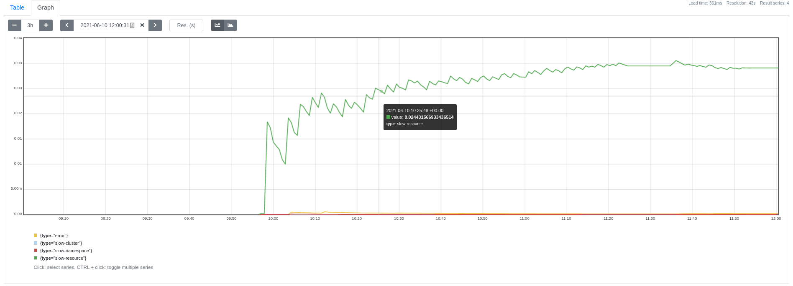
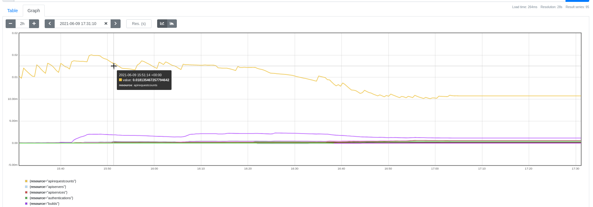

# KubeAPIErrorBudgetBurn

## Meaning

[These alerts][KubeAPIErrorBudgetBurn] are triggered when the Kubernetes API
server is encountering:

* Many 5xx failed requests and/or
* Many slow requests

The urgency of these alerts is determined by the values of their `long` and
`short` labels:

* Critical
  * `long`: 1h and `short`: 5m: less than ~2 days -- You should fix the problem
as soon as possible!
  * `long`: 6h and `short`: 30m: less than ~5 days -- Track this down now but no
immediate fix required.
* Warning
  * `long`: 1d and `short`: 2h: less than ~10 days -- This is problematic in the
long run. You should take a look in the next 24-48 hours.
  * `long`: 3d and `short`: 6h: less than ~30 days -- (the entire window of the
error budget) at this rate. This means that at the end of the next 30 days there
won't be any error budget left at this rate. It's fine to leave this over the
weekend and have someone take a look in the coming days at working hours.

Information in this runbook is derived from the
[upstream runbook][upstream runbook].

Note that in OCP 4.8, these alerts have been [rewritten][alert PR], so they are
no longer the same as the upstream ones.

## Impact

The overall availability of the cluster isn't guaranteed anymore. The API
server is returning too many errors and/or responses are taking too long for
guarantee reconciliation.

## Diagnosis

The following [recording rules][recording rules] can be used to determine the
main contributors of the alerts, after adjusting their range to match the `long`
and `short` labels of the active alerts:

```sh
# error
label_replace(
  sum(rate(apiserver_request_total{job="apiserver",verb=~"LIST|GET",code=~"5.."}[1d]))
/ scalar(sum(rate(apiserver_request_total{job="apiserver",verb=~"LIST|GET"}[1d])))
, "type", "error", "_none_", "")
or
# resource-scoped latency
label_replace(
  (
    sum(rate(apiserver_request_duration_seconds_count{job="apiserver",verb=~"LIST|GET",subresource!~"proxy|log|exec",scope="resource"}[1d]))
  -
    (sum(rate(apiserver_request_duration_seconds_bucket{job="apiserver",verb=~"LIST|GET",subresource!~"proxy|log|exec",scope="resource",le="0.1"}[1d])) or vector(0))
  ) / scalar(sum(rate(apiserver_request_total{job="apiserver",verb=~"LIST|GET",subresource!~"proxy|log|exec"}[1d])))
, "type", "slow-resource", "_none_", "")
or
# namespace-scoped latency
label_replace(
  (
    sum(rate(apiserver_request_duration_seconds_count{job="apiserver",verb=~"LIST|GET",subresource!~"proxy|log|exec",scope="namespace"}[1d]))
  - sum(rate(apiserver_request_duration_seconds_bucket{job="apiserver",verb=~"LIST|GET",subresource!~"proxy|log|exec",scope="namespace",le="0.5"}[1d]))
  ) / scalar(sum(rate(apiserver_request_total{job="apiserver",verb=~"LIST|GET",subresource!~"proxy|log|exec"}[1d])))
, "type", "slow-namespace", "_none_", "")
or
# cluster-scoped latency
label_replace(
  (
    sum(rate(apiserver_request_duration_seconds_count{job="apiserver",verb=~"LIST|GET",scope="cluster"}[1d]))
    - sum(rate(apiserver_request_duration_seconds_bucket{job="apiserver",verb=~"LIST|GET",scope="cluster",le="5"}[1d]))
  ) / scalar(sum(rate(apiserver_request_total{job="apiserver",verb=~"LIST|GET"}[1d])))
, "type", "slow-cluster", "_none_", "")
```

In this example, the `slow-resource` error type appears to be the main
contributor to the alerts:



Use the `slow-resource` query from the above recording rules to identify the
resource kinds that contribute to the SLO violation:

```sh
sum by(resource) (rate(apiserver_request_duration_seconds_count{job="apiserver",verb=~"LIST|GET",subresource!~"proxy|log|exec",scope="resource"}[1d]))
-
(sum by(resource) (rate(apiserver_request_duration_seconds_bucket{job="apiserver",verb=~"LIST|GET",subresource!~"proxy|log|exec",scope="resource",le="0.1"}[1d])) or vector(0))
/ scalar(sum(rate(apiserver_request_total{job="apiserver",verb=~"LIST|GET",subresource!~"proxy|log|exec"}[1d])))
```

In this example, requests to the `apirequestcounts` resource kind appear to be
the ones experiencing high latency:



If accessible, the following Grafana dashboards will can also provide further
insights into request duration and API server and etcd performance:

* API Request Duration by Verb
* etcd Request Duration - 99th Percentile
* etcd Object Count
* Request Duration by Read vs Write - 99th Percentile
* Long Running Requests by Resource

## Mitigation

### Restart the kubelet (after upgrade)

If these alerts are triggered following a cluster upgrade, try restarting the
kubelets per description [here][5420801].

### Determine the source of the error or slow requests

There isn't a straightforward way to identify the root causes, but in the past
we were able to narrow down bugs by examining the failed resource counts in the
audit logs.

Gather the audit logs of the cluster:

```sh
oc adm must-gather -- /usr/bin/gather_audit_logs
```

Install the [cluster-debug-tools][cluster-debug-tools] as a kubectl/oc plugin.

Use the `audit` subcommands to gather information on users that sends the
requests, the resource kinds, the request verbs etc.

E.g. to determine who generate the `apirequestcount` resource slow requests and
what these requests are doing:

```sh
oc dev_tool audit -f ${kube-apiserver-audit-log-dir} -otop --by=user resource="apirequestcounts"

oc dev_tool audit -f ${kube-apiserver-audit-log-dir} -otop --by=verb resource="apirequestcounts" --user=${top-user-from-last-command}
```

The `audit` subcommand also supports the `--failed-only` option which can be
used to return failed requests only:

```sh
# find the top-10 users with the highest failed requests count
oc dev_tool audit -f ${kube-apiserver-audit-log-dir} --by user --failed-only -otop

# find the top-10 failed API resource calls of a specific user
oc dev_tool audit -f ${kube-apiserver-audit-log-dir} --by resource --user=${service_account} --failed-only -otop

# find the top-10 failed API verbs of a specific user on a specific resource
oc dev_tool audit -f ${kube-apiserver-audit-log-dir} --by verb --user=${service_account} --resource=${resources} --failed-only -otop
```

When filing a new Bugzilla issue, be sure to attach this information and the
audit logs to it.

[alert PR]: https://github.com/openshift/cluster-kube-apiserver-operator/pull/1126
[cluster-debug-tools]: https://github.com/openshift/cluster-debug-tools
[KubeAPIErrorBudgetBurn]: https://github.com/openshift/cluster-kube-apiserver-operator/blob/622c08f101555be4584cb897f68f772777b32ada/bindata/v4.1.0/alerts/kube-apiserver-slos.yaml
[recording rules]: https://github.com/openshift/cluster-kube-apiserver-operator/blob/c1c38912859e8b023a1da9168960e2c712068d5b/bindata/v4.1.0/alerts/kube-apiserver-slos.yaml#L234-L267
[upstream runbook]: https://github.com/prometheus-operator/kube-prometheus/wiki/KubeAPIErrorBudgetBurn
[5420801]: https://access.redhat.com/solutions/5420801
